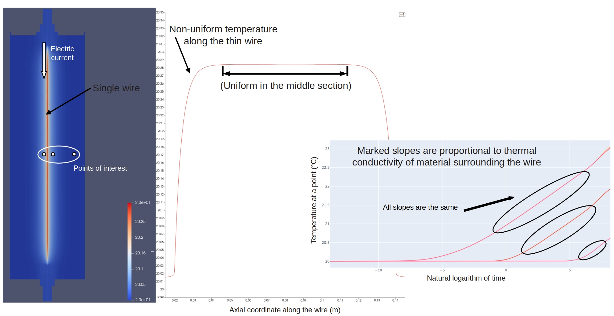
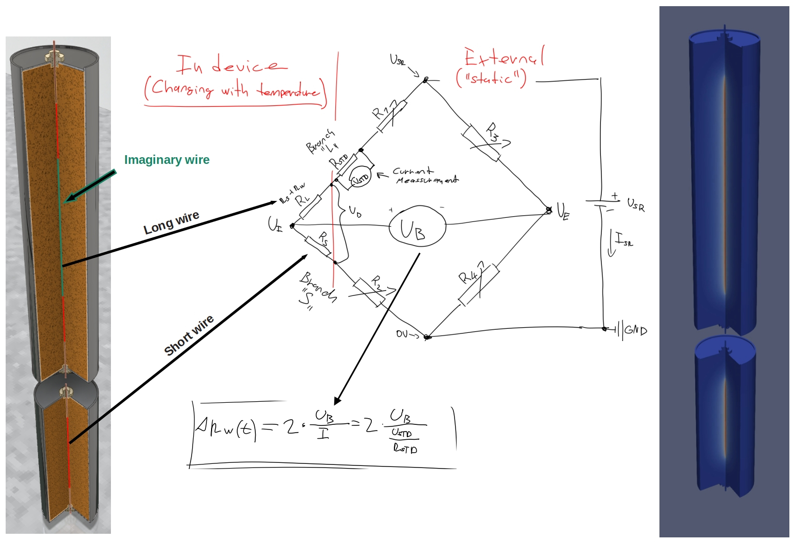

# What is this example
This example simulates the transient hot wire (THW) method for measuring
thermal conductivity of granular materials such as sand. It models a dual-wire
THW probe inside a cylindrical steel case, computes the evolving resistance of
each wire, and derives the Wheatstone bridge voltage from which thermal
conductivity is extracted. The simulation allows assessing the magnitude and
time evolution of the voltage signal so that appropriate electrical equipment
can be selected
(see this [link](https://doi.org/10.1016/j.applthermaleng.2016.05.138)).

### Main idea of THW
The method is based on the fact that there is a correlation between the rate
of change of the wire's temperature over time (more precisely the natural
logarithm of time) and the thermal conductivity of the material that
surrounds the wire. This temperature change is induced with electrical current
through the wire. The temperature is calculated from the changing resistance
of the wire itself.

### Compensation for non-uniform temperature in the wire
After an electrical current is applied to the wire of finite length, a
non-uniform temperature distribution along this wire is created. The
resistance reading in the middle of the wire would be wrong due to this.

To compensate for this non-uniformity, two wires are used instead — one long
and one short.

The wires will have very similar temperature profiles near their ends. We can
look at the difference of the resistances of these two wires instead. This
gives us the resistance of an imaginary wire (the middle section of the longer
wire) that has an almost uniform temperature distribution (because there is a
flat spot in the temperature profile in the middle of the long wire).

The resistance of this imaginary wire is then used to calculate the thermal
conductivity of the material. After this compensation there are very few
things that affect the reading, and very low measurement uncertainty can be
achieved.

### Physical setup
The probe geometry is imported from a STEP file (`TwoWire.stp`) created in
Autodesk Inventor and converted to a 2D axisymmetric mesh. The assembly
consists of:

- **Long tantalum wire** — 150 mm, diameter 0.2 mm
- **Short tantalum wire** — 70 mm, diameter 0.2 mm
- **Steel electrodes** — connecting the wires to external circuitry
- **Sand fill** — the material under test, surrounding both wires
- **Insulation** — thermal housing around the sand
- **Steel case and lid** — outer enclosure of the probe

Both wires carry the same electrical current in series
(`SerialWiresResistiveHeating` term). The current is adjusted at each time
step to maintain constant total power dissipation (P = 0.12 W by default).

### Simulation model
The model (`model.py`) derives from the base `Simulation` class and defines:

- **Source term** — `SerialWiresResistiveHeating` applied to both wire
  subdomains. The resistive heating `I²·σ(T)/A²` is temperature-dependent
  through the electrical resistivity `σ(T)` of tantalum, making the problem
  nonlinear.
- **Boundary term** — `AmbientCooling` on the `"outer_surface"` of the case.

The `run_experiment` method sets up the constant-power current control loop
and records the initial imaginary-wire resistance `R₀` for the bridge
calculation. After the transient solve, `calculate_lmbd` post-processes the
CSV output to extract thermal conductivity.

### Tracked quantities
The simulation records a comprehensive set of probes at each output step:

| Probe | Description |
|-------|-------------|
| `T[0]`–`T[3]` | Temperature at wire mid-point, wire surface, sand, and case |
| `long_R`, `short_R` | Resistance of each wire [mΩ] |
| `imag_R` | Resistance of the imaginary wire (long − short) [mΩ] |
| `R` | Total series resistance (long + short) [mΩ] |
| `I` | Current through the wires [A] |
| `long_U`, `short_U` | Voltage drop across each wire [V] |
| `long_TfR`, `short_TfR`, `imag_TfR` | Temperature inferred from resistance [°C] |
| `long_power`, `short_power`, `total_power` | Dissipated power [W] |
| `ql`, `ql_mid` | Linear heat generation rate [W/m] |
| `delta_Rw` | Change of imaginary-wire resistance since t = 0 [mΩ] |
| `U_b` | Wheatstone bridge output voltage [mV] |
| `U_std` | Voltage across the standard resistor [V] |
| `heat` | Total thermal energy stored in the domain [J] |
| `heat loss` | Heat flow through the outer surface [W] |

### Post-processing
After the transient solve, `calculate_lmbd` reads the CSV file and computes:

1. The natural logarithm of simulation time `ln(t)`.
2. The derivative of each probe temperature with respect to `ln(t)`.
3. Thermal conductivity `λ = q_l / (4π · dT/d(ln t))` for each probe
   location and for the imaginary-wire temperature.

The output is written to a separate CSV file (`LMBD_result.csv`).

### Running the example
The `run_example.py` script performs the following steps:

1. Loads the STEP geometry and builds a 2D axisymmetric mesh.
2. Creates the FEM simulation with serial wire heating and ambient cooling.
3. Runs a 5-second transient with very tight tolerances and fine initial
   time stepping (the early-time signal is critical for THW accuracy).
4. Writes probe data to `results/unsteady.csv`.
5. Post-processes the data to extract `λ` and saves `results/LMBD_result.csv`.

### Files

| File | Purpose |
|------|---------|
| `TwoWire.stp` | CAD geometry of the dual-wire THW probe (Autodesk Inventor) |
| `geometry.py` | STEP file loader + material/boundary assignment + mesh generation |
| `model.py` | FEM simulation class with wire heating, resistance and bridge probes |
| `run_example.py` | Experiment setup, transient solve, and λ post-processing |
| `assets/THW_01.jpg` | Diagram of single-wire THW principle |
| `assets/THW_02.jpg` | Diagram of dual-wire compensation and Wheatstone bridge circuit |
